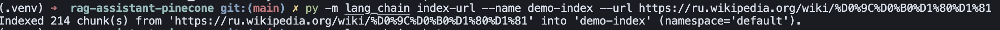
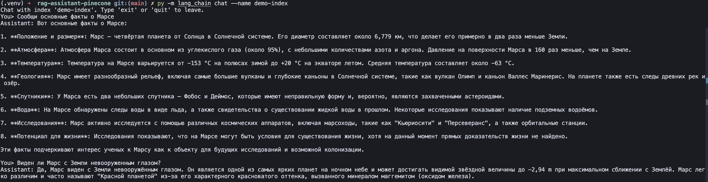

# RAG-ассистент CLI (LangChain + Pinecone)

CLI на Python для работы с векторной базой [Pinecone](https://www.pinecone.io/)
через [LangChain](https://www.langchain.com/). Поддерживает индексацию
документов и веб-страниц по URL, семантический поиск и интерактивный
RAG-чат с tools.

Эмбеддинги и LLM вызываются через [ProxyAPI](https://proxyapi.ru/) (OpenAI-
совместимый API).

## Возможности

| Команда     | Описание |
| ----------- | -------- |
| `index`     | Создание serverless-индекса (если ещё нет) и загрузка документов |
| `index-url` | Загрузка веб-страницы по URL, разбиение на чанки и индексация |
| `search`    | Семантический поиск по индексу |
| `chat`      | Диалог с RAG, tools и историей ввода |

Источник данных для `index`: одна строка (`--text`) или файл `.txt` /
`.json` (`--file`). Команда `index-url` принимает адрес веб-страницы
(`--url`).

## Требования

- Python 3.11+
- API-ключ [Pinecone](https://app.pinecone.io/)
- API-ключ [ProxyAPI](https://proxyapi.ru/)

## Установка

```bash
python3 -m venv .venv
source .venv/bin/activate
pip install -r requirements.txt
```

Или через Makefile (если настроен `pipi`):

```bash
make venv
make install
```

## Настройка

```bash
cp .env.example .env
```

| Переменная         | Описание |
| ------------------ | -------- |
| `PINECONE_API_KEY` | Ключ Pinecone |
| `PROXYAPI_API_KEY` | Ключ ProxyAPI |
| `PINECONE_CLOUD`   | Облако (по умолчанию `aws`) |
| `PINECONE_REGION`  | Регион (по умолчанию `us-east-1`) |
| `CHAT_MODEL`       | LLM для chat (по умолчанию `gpt-4o-mini`) |

## Быстрый старт

```bash
# 1. Индексация
python -m lang_chain index \
  --name demo-index \
  --file data/canon-nikon-phrases.txt

# 2. Поиск
python -m lang_chain search \
  --name demo-index \
  --query "Совместимы ли байонеты CANON и NIKON?"

# 3. Диалог
python -m lang_chain chat --name demo-index
```

## Использование

### Индексация

Одна строка:

```bash
python -m lang_chain index \
  --name demo-index \
  --text "Canon выпускает зеркальные и беззеркальные камеры"
```

Из `.txt` (одна строка — один документ, пустые пропускаются):

```bash
python -m lang_chain index \
  --name cameras \
  --file data/canon-nikon-phrases.txt
```

Из `.json` (массив строк или объектов с полем `text` / `content`):

```bash
python -m lang_chain index \
  --name demo-index \
  --file etc/sample.json
```

С namespace:

```bash
python -m lang_chain index \
  --name demo-index \
  --file etc/sample.txt \
  --namespace my-ns
```

### Индексация URL

Команда `index-url` загружает HTML-страницу, извлекает текст,
разбивает его на чанки и векторизует в Pinecone. После этого
содержимое страницы доступно в `search` и `chat` наравне с
документами из `index`.

```bash
python -m lang_chain index-url \
  --name demo-index \
  --url https://ru.wikipedia.org/wiki/Марс
```

Параметры чанкирования (по умолчанию: размер 1000 символов,
перекрытие 200):

```bash
python -m lang_chain index-url \
  --name demo-index \
  --url https://ru.wikipedia.org/wiki/Марс \
  --chunk-size 1000 \
  --chunk-overlap 200
```

С namespace:

```bash
python -m lang_chain index-url \
  --name demo-index \
  --url https://example.com \
  --namespace web-pages
```

### Поиск

```bash
python -m lang_chain search \
  --name cameras \
  --query "когда основана компания Canon" \
  --top-k 5
```

### Диалог (chat)

Интерактивный RAG-чат: ответы строятся по документам из индекса. Строку
ввода можно редактировать (←/→), история запросов — стрелками ↑/↓
(файл `~/.lang_chain_history`). Выход: `exit`, `quit`, Ctrl+C или Ctrl+D.

**Tools в chat:**

| Tool | Когда используется |
| ---- | ------------------ |
| `search_internet` | Ответа нет в базе знаний — поиск через DuckDuckGo |
| `get_currency_rate` | Вопросы о курсе валют (USD, EUR, RUB и др.) |

Если ответ опирается на интернет, ассистент явно указывает это в тексте
(и добавляется пометка «данные из интернета (DuckDuckGo)»).

```bash
python -m lang_chain chat \
  --name cameras \
  --top-k 5
```

### Makefile

```bash
make cli-index                          # etc/sample.txt → demo-index
make cli-index-url                      # example.com → demo-index
make cli-search                         # поиск в demo-index
make cli-chat                           # диалог с demo-index

make cli-index INDEX=cameras
make cli-index-url INDEX=cameras
make cli-search INDEX=cameras
make cli-chat INDEX=cameras
```

## Примеры с скриншотами

Данные: `data/canon-nikon-phrases.txt` (102 фразы про Canon и Nikon).

### Индексация

```bash
python -m lang_chain index \
  --name demo-index \
  --file data/canon-nikon-phrases.txt
```


### Поиск

```bash
python -m lang_chain search \
  --name demo-index \
  --query "Совместимы ли байонеты CANON и NIKON?"
```


```bash
python -m lang_chain search \
  --name demo-index \
  --query "Когда был представлен байонет EF?"
```


```bash
python -m lang_chain search \
  --name demo-index \
  --query "У кого матрица больше, у CANON или NIKON?"
```


```bash
python -m lang_chain search \
  --name demo-index \
  --query "Что такое беззеркальная система фотокамеры?"
```


```bash
python -m lang_chain search \
  --name demo-index \
  --query "Что еще выпускала NIKON кроме фотокамер?"
```


### Индексация URL (Марс)

Источник: статья [«Марс»](https://ru.wikipedia.org/wiki/Марс) в Википедии.

```bash
python -m lang_chain index-url \
  --name demo-index \
  --url https://ru.wikipedia.org/wiki/Марс
```



### Диалог по данным с URL

После индексации страницы можно задавать вопросы в `chat` — ответы
строятся по чанкам из базы знаний:

```bash
python -m lang_chain chat --name demo-index
```



## Структура проекта

```
lang_chain/
  cli.py             # команды index, index-url, search, chat
  config.py          # настройки из .env
  console.py         # readline: редактирование строки и история ввода
  loaders.py         # загрузка .txt / .json
  url_loader.py      # загрузка URL, парсинг HTML, чанкирование
  embeddings.py      # OpenAIEmbeddings через ProxyAPI
  llm.py             # ChatOpenAI через ProxyAPI
  store.py           # PineconeVectorStore, создание индекса
  services.py        # оркестрация index / search
  chat.py            # RAG-диалог
  tool_runner.py     # цикл вызова LangChain tools
  tools/
    web_search.py    # DuckDuckGo (ddgs)
    currency.py      # курсы валют (open.er-api.com)
data/                # примеры данных
docs/                # скриншоты
etc/                 # sample-файлы
```

## Технологии

Краткий обзор стека, используемого в CLI.

### Python и CLI

| Технология | Роль в проекте |
| ---------- | -------------- |
| **Python 3.11+** | Язык и среда выполнения |
| **Click** | Парсинг аргументов, подкоманды (`index`, `index-url`, `search`, `chat`), `--help` |
| **readline** (stdlib) | Редактирование строки в chat, история ↑/↓, файл `~/.lang_chain_history` |
| **python-dotenv** | Загрузка ключей и настроек из `.env` |
| **Makefile** | Шорткаты `make cli-index`, `cli-index-url`, `cli-search`, `cli-chat` |

### LangChain

| Компонент | Роль в проекте |
| --------- | -------------- |
| **langchain-core** | Сообщения, `@tool`, tool calling, базовые абстракции |
| **langchain-openai** | `OpenAIEmbeddings`, `ChatOpenAI` |
| **langchain-pinecone** | `PineconeVectorStore` — upsert и similarity search |
| **langchain-text-splitters** | `RecursiveCharacterTextSplitter` — чанкирование текста с URL |
| **RAG** | В `chat`: retrieval из Pinecone → контекст → ответ LLM |
| **Tool calling** | LLM вызывает `search_internet` и `get_currency_rate` по необходимости |

### Модели и API

| Технология | Роль в проекте |
| ---------- | -------------- |
| **ProxyAPI** | Прокси к OpenAI API (`https://api.proxyapi.ru/openai/v1`) |
| **text-embedding-3-small** | Эмбеддинги, 1536 измерений (`index`, `search`, `chat`) |
| **gpt-4o-mini** (по умолчанию) | LLM для `chat`, настраивается через `CHAT_MODEL` |

### Векторная база

| Технология | Роль в проекте |
| ---------- | -------------- |
| **Pinecone** | Serverless vector index, метрика cosine similarity |
| **pinecone** (SDK) | Создание индекса, upsert, query через LangChain-обёртку |

### Загрузка веб-страниц (index-url)

| Технология | Роль в проекте |
| ---------- | -------------- |
| **httpx** | HTTP-запросы к веб-страницам |
| **beautifulsoup4** | Парсинг HTML, извлечение текста |
| **langchain-text-splitters** | Разбиение длинных страниц на чанки |

### Tools (chat)

| Технология | Роль в проекте |
| ---------- | -------------- |
| **ddgs** | Поиск в интернете через DuckDuckGo, если ответа нет в базе |
| **open.er-api.com** | Актуальные курсы валют (без API-ключа), tool `get_currency_rate` |
| **urllib** (stdlib) | HTTP-запросы к API курсов валют |

### Параметры индекса

- **Модель эмбеддингов:** `text-embedding-3-small` (1536 dim)
- **Метрика:** cosine similarity
- **Тип индекса:** Pinecone serverless (`PINECONE_CLOUD`, `PINECONE_REGION`)
