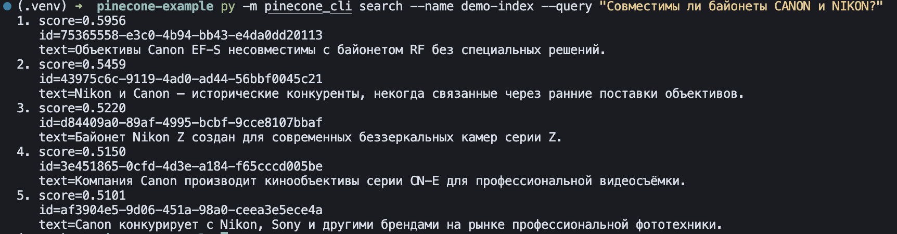
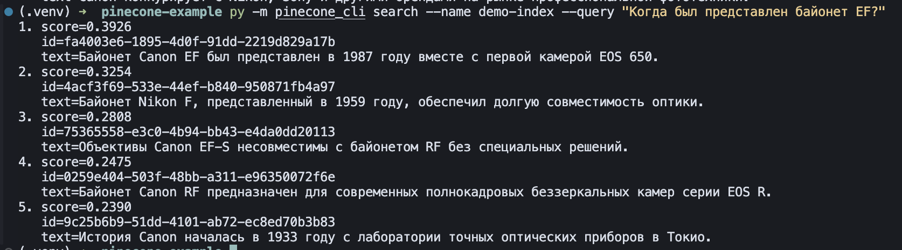
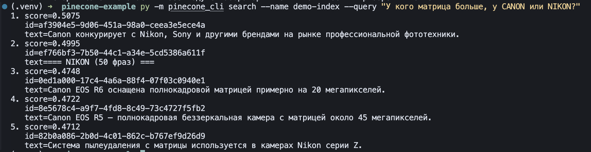
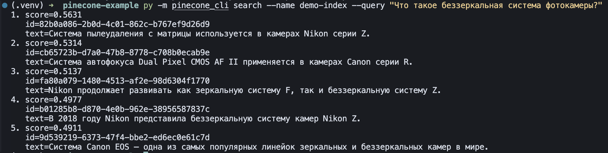
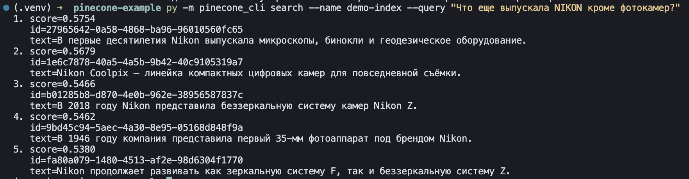

# LangChain Example CLI

Простой CLI-сервис на Python для тестирования работы с векторной БД
[Pinecone](https://www.pinecone.io/) через
[LangChain](https://www.langchain.com/). Эмбеддинги создаются через
[ProxyAPI](https://proxyapi.ru/) с моделью OpenAI `text-embedding-3-small`.

## Возможности

- **index** — создание serverless-индекса (если ещё нет) и загрузка
  документов с эмбеддингами
- **search** — семантический поиск по индексу
- **chat** — диалог с RAG: ответы на основе найденных документов

Источник данных: одна строка (`--text`) или файл `.txt` / `.json`
(`--file`).

## Требования

- Python 3.11+
- API-ключ [Pinecone](https://app.pinecone.io/)
- API-ключ [ProxyAPI](https://proxyapi.ru/)

## Установка

```bash
python3 -m venv .venv
source .venv/bin/activate
pip install -r requirements.txt
```

Или через Makefile (если настроен `pipi`):

```bash
make venv
make install
```

## Настройка

Скопируйте шаблон и заполните ключи:

```bash
cp .env.example .env
```

| Переменная           | Описание                          |
| -------------------- | --------------------------------- |
| `PINECONE_API_KEY`   | Ключ Pinecone                     |
| `PROXYAPI_API_KEY`   | Ключ ProxyAPI                     |
| `PINECONE_CLOUD`     | Облако (по умолчанию `aws`)       |
| `PINECONE_REGION`    | Регион (по умолчанию `us-east-1`) |
| `CHAT_MODEL`         | LLM для chat (по умолчанию `gpt-4o-mini`) |

## Примеры использования

Ниже — реальные сессии работы с CLI. Данные для индексации
взяты из `data/canon-nikon-phrases.txt` (102 фразы про Canon и Nikon).

### Индексация файла

```bash
python -m lang_chain index \
  --name demo-index \
  --file data/canon-nikon-phrases.txt
```


### Поиск: совместимость байонетов

```bash
python -m lang_chain search \
  --name demo-index \
  --query "Совместимы ли байонеты CANON и NIKON?"
```



### Поиск: история байонета EF

```bash
python -m lang_chain search \
  --name demo-index \
  --query "Когда был представлен байонет EF?"
```



### Поиск: сравнение матриц

```bash
python -m lang_chain search \
  --name demo-index \
  --query "У кого матрица больше, у CANON или NIKON?"
```



### Поиск: беззеркальные системы

```bash
python -m lang_chain search \
  --name demo-index \
  --query "Что такое беззеркальная система фотокамеры?"
```



### Поиск: продукция Nikon

```bash
python -m lang_chain search \
  --name demo-index \
  --query "Что еще выпускала NIKON кроме фотокамер?"
```



## Использование

### Индексация

Одна строка:

```bash
python -m lang_chain index \
  --name demo-index \
  --text "Canon выпускает зеркальные и беззеркальные камеры"
```

Из текстового файла (одна строка — один документ, пустые пропускаются):

```bash
python -m lang_chain index \
  --name cameras \
  --file data/canon-nikon-phrases.txt
```

Из JSON (массив строк или объектов с полем `text` / `content`):

```bash
python -m lang_chain index \
  --name demo-index \
  --file etc/sample.json
```

Опционально — namespace:

```bash
python -m lang_chain index \
  --name demo-index \
  --file etc/sample.txt \
  --namespace my-ns
```

### Поиск

```bash
python -m lang_chain search \
  --name cameras \
  --query "когда основана компания Canon" \
  --top-k 5
```

### Диалог (chat)

Интерактивный режим: вопросы и ответы с учётом контекста из индекса.
Для выхода введите `exit`, `quit` или нажмите Ctrl+C / Ctrl+D.

```bash
python -m lang_chain chat \
  --name cameras \
  --top-k 5
```

### Makefile

```bash
make cli-index                          # etc/sample.txt → demo-index
make cli-search                         # поиск в demo-index
make cli-chat                           # диалог с demo-index

make cli-index INDEX=cameras            # свой индекс
make cli-search INDEX=cameras           # поиск в cameras
make cli-chat INDEX=cameras             # диалог с cameras
```

Для индексации `data/canon-nikon-phrases.txt`:

```bash
python -m lang_chain index \
  --name cameras \
  --file data/canon-nikon-phrases.txt

python -m lang_chain search \
  --name cameras \
  --query "история Nikon" \
  --top-k 3
```

## Структура проекта

```
lang_chain/
  config.py          # настройки из .env
  loaders.py         # загрузка текста и файлов
  embeddings.py      # OpenAIEmbeddings через ProxyAPI
  llm.py             # ChatOpenAI через ProxyAPI
  store.py           # PineconeVectorStore (LangChain)
  chat.py            # RAG-диалог
  services.py        # оркестрация index / search
  cli.py             # команды CLI
data/                # примеры данных
docs/                # скриншоты примеров использования
etc/                 # sample-файлы и заметки
```

## Технические детали

- LangChain: `OpenAIEmbeddings`, `ChatOpenAI`, `PineconeVectorStore`
- Модель эмбеддингов: `text-embedding-3-small` (1536 измерений)
- ProxyAPI endpoint: `https://api.proxyapi.ru/openai/v1`
- Метрика индекса: cosine similarity
- Тип индекса: Pinecone serverless
